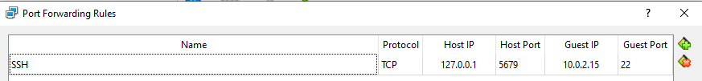
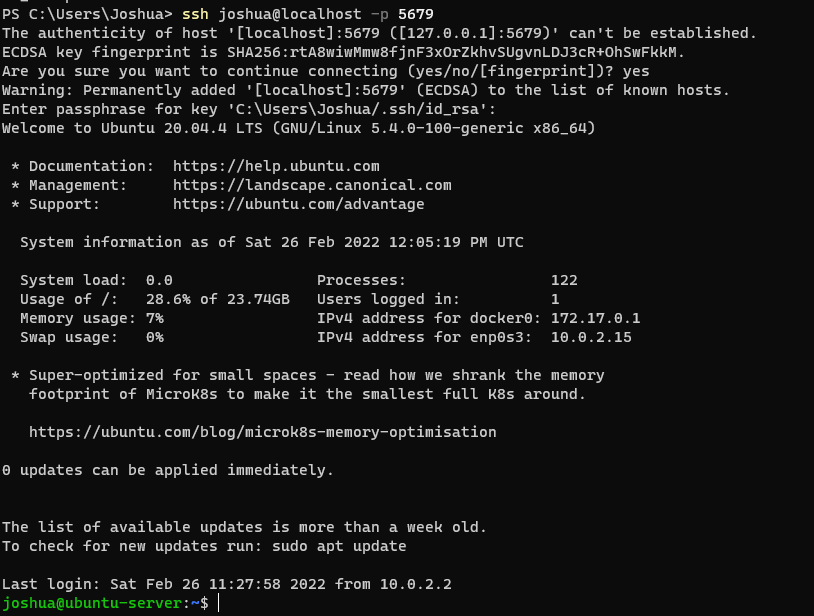
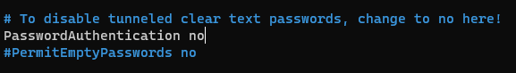
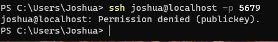
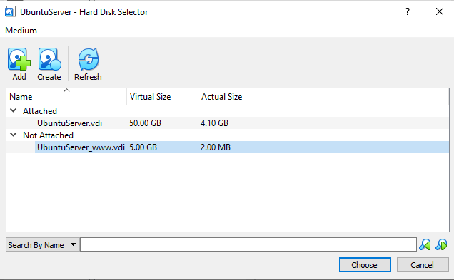
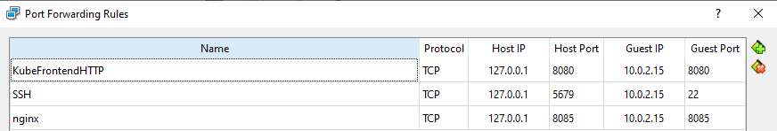
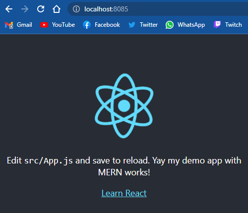
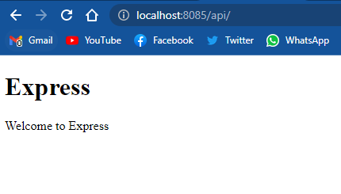
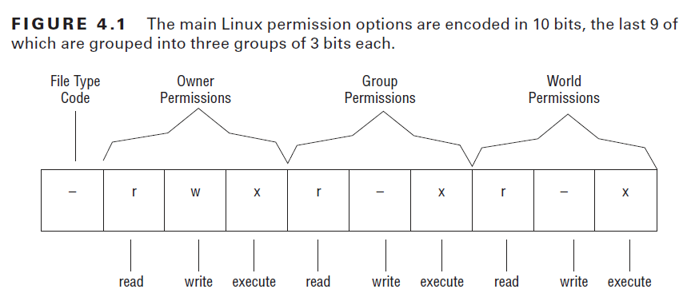
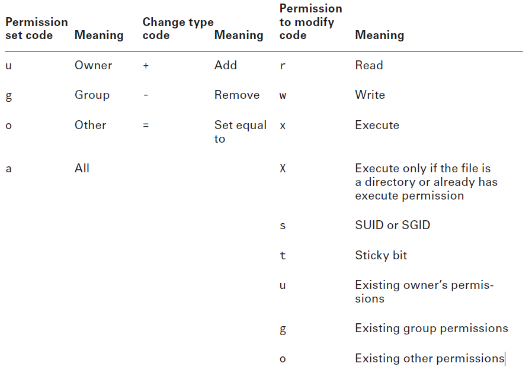

# Workbook Betriebssysteme hftm

- [Workbook Betriebssysteme hftm](#workbook-betriebssysteme-hftm)
  - [Installation & Einrichtung Linux VM](#installation--einrichtung-linux-vm)
  - [SSH](#ssh)
    - [SSH Key](#ssh-key)
    - [SSH Key only Authentication](#ssh-key-only-authentication)
  - [Filesystem und LEMP](#filesystem-und-lemp)
    - [Disks auf unserer Ubuntu VM](#disks-auf-unserer-ubuntu-vm)
    - [Disk hinzufügen](#disk-hinzufügen)
  - [Webserver](#webserver)
    - [MERN](#mern)
      - [MongoDB](#mongodb)
      - [Node.js](#nodejs)
      - [React.js](#reactjs)
      - [Express.js](#expressjs)
      - [Nginx](#nginx)
  - [Permissions](#permissions)
    - [Permissions ändern](#permissions-ändern)
    - [Aufgabe - User & Permission Management](#aufgabe---user--permission-management)
  - [Bash Script](#bash-script)
    - [Bash Script mit dynamischen Input um User hinzuzufügen](#bash-script-mit-dynamischen-input-um-user-hinzuzufügen)
  - [Package Management](#package-management)
    - [Repositories hinzufügen und Packages installieren](#repositories-hinzufügen-und-packages-installieren)
    - [Anzahl Packages in einem Repo](#anzahl-packages-in-einem-repo)
    - [APT & Snap](#apt--snap)
      - [APT](#apt)
      - [Snap](#snap)
      - [APT vs Snap](#apt-vs-snap)
      - [Use-Cases](#use-cases)
  - [Docker](#docker)
    - [Docker volumes](#docker-volumes)
    - [Eigene images](#eigene-images)
    - [Docker Networks](#docker-networks)
      - [Eigene Netzwerke](#eigene-netzwerke)
      - [Container Services veröffentlichen](#container-services-veröffentlichen)
  - [Networking](#networking)
    - [DNS](#dns)
    - [DHCP](#dhcp)

## Installation & Einrichtung Linux VM

Als erstes habe ich mir VirtualBox heruntergeladen und gemäss Anleitung ["Installation Linux Distro"](https://eight-chair-fec.notion.site/Installation-Linux-Distro-f9224eadcb124b35a61eebbbeeb98210) eine neue Virtuelle Maschine erstellt. Dann habe ich die Ubuntu Iso heruntergeladen und installiert.

## SSH

Bei der Linux Installation wurde bereits OpenSSH mitinstalliert auf der VM, wird müssen also nichts mehr installieren.
Auf dem Host habe ich als erstes Port Forwarding in VirtualBox eingerichtet:
  
Dann habe ich mich via PowerShell auf dem Host mit der VM verbunden: `ssh joshua@127.0.0.1 -p 5679`

### SSH Key

Um mich in Zukunft ohne Passwort mit der VM Verbinden zu können habe ich ein SSH key eingerichtet. Dafür habe ich zuerst einen neuen ssh key in PowerShell mit dem Befehl `ssh-keygen` erstellt. Bei Windows wird dieser standardmässig in einem .ssh Ordner im user Profil abgelegt, bei mir also unter `"C:\Users\Joshua\.ssh\id_rsa.pub"`

Da die Windows Implementation von OpenSSH leider den Command `ssh-copy-id` nicht unterstützt, habe ich das File mit scp manuell auf die VM kopiert: `scp -P 5679 $env:USERPROFILE\.ssh\id_rsa.pub joshua@127.0.0.1:/home/joshua/windows10_rsa.pub` wichtig ist die Port Option hier mit grossem P zu verwenden, da -p der scp parameter für die preserves Option verwendet wird.

Als nächstes habe ich dann auf der Linux VM das Verzeichnis .ssh und die Datei authorized_keys erstellt:
`mkdir -p ~/.ssh` & `touch ~/.ssh/authorized_keys`
Nun kopiere ich den Inhalt meines public keys in das authorized_keys file: `cat ~/windows10_rsa.pub >> ~/.ssh/authorized_keys`
Nun kann ich mich verbinden ohne mein User Passwor einzugeben:


Da ich aus Sicherheitsgründen meinem private Key eine Passphrase gegeben habe muss ich diese eingeben, hätte ich aber ein key ohne Passphrase generiert könnte ich ohne jegliche Eingabe von Passwort eine ssh Verbindung auf die VM herstellen.

### SSH Key only Authentication

Um die VM sicherer zu machen, kann man das Login via User Passwort ausschalten, so kann nur noch mit dem ssh-key zugegriffen werden, also auch nur von Servern/PC's welche einen korrekten private key haben zudem der public key auf der vm ist. Das ganze habe ich gemacht indem ich in der sshd_config Datei die Password Authentication disabled habe:


Nun muss die Konfiguration noch neu geladen werden mit: `sudo systemctl reload ssh`

Wenn ich nun versuche mich auf die VM zu verbinden und den private key nicht habe, erhalte ich Permission denied und es wird nicht nach dem Passwort gefragt, da dies disabeld ist.



## Filesystem und LEMP

### Disks auf unserer Ubuntu VM

Ich habe mir mit `sudo fdisk -l` alle Disks anzeigen lassen. Insgesamt sind es 7 Disks, 6 "dev/loop" disks mit jeweils 40-75Mib bytes und die Virtuelle Harddisk die beim erstellen der VM angelegt wurde mit 50GiB Speicher.

Mit `sudo fsdisk -l | grep -i Disk` erhält nur die Informationen der ersten Zeile und die Liste wird übersichtlicher.

```Disk /dev/loop0: 61.91 MiB, 64897024 bytes, 126752 sectors
Disk /dev/loop1: 67.94 MiB, 71221248 bytes, 139104 sectors
Disk /dev/loop2: 55.45 MiB, 58130432 bytes, 113536 sectors
Disk /dev/loop3: 43.6 MiB, 45703168 bytes, 89264 sectors
Disk /dev/loop4: 55.52 MiB, 58204160 bytes, 113680 sectors
Disk /dev/loop5: 70.32 MiB, 73728000 bytes, 144000 sectors
Disk /dev/sda: 50 GiB, 53687091200 bytes, 104857600 sectors
```

Um die Partitionen zu sehen habe ich den Befehl `lsblk` verwendet. Insgesamt sind hat unsere VM 12 Partitionen, 6 für die loop Disk und 5 für unsere Harddisk und eine für die rom.

```
NAME                      MAJ:MIN RM  SIZE RO TYPE MOUNTPOINT
loop0                       7:0    0 61.9M  1 loop /snap/core20/1361
loop1                       7:1    0 67.9M  1 loop /snap/lxd/22526
loop2                       7:2    0 55.4M  1 loop /snap/core18/2128
loop3                       7:3    0 43.6M  1 loop /snap/snapd/14978
loop4                       7:4    0 55.5M  1 loop /snap/core18/2284
loop5                       7:5    0 70.3M  1 loop /snap/lxd/21029
sda                         8:0    0   50G  0 disk
├─sda1                      8:1    0    1M  0 part
├─sda2                      8:2    0  1.5G  0 part /boot
└─sda3                      8:3    0 48.5G  0 part
  └─ubuntu--vg-ubuntu--lv 253:0    0 24.3G  0 lvm  /
sr0                        11:0    1 1024M  0 rom
```

Die UUID's der Partionen habe ich mir mit `sudo blkid | grep UUID=` anzeigen lassen:

```/dev/sda2: UUID="8e68e83d-1274-4aaa-902a-90a1de3162cb" TYPE="ext4" PARTUUID="55ae0ae9-10d7-4eba-86d3-6017260876f0"
/dev/sda3: UUID="Ho1hA2-lloz-36t7-akHa-JEvn-4q1L-Xtop5i" TYPE="LVM2_member" PARTUUID="5458d8b3-d493-41cf-b4ff-27ed2f948707"
/dev/mapper/ubuntu--vg-ubuntu--lv: UUID="a2ba3be5-ea02-484f-b866-f66ee8bdf182" TYPE="ext4"
/dev/sda1: PARTUUID="71f35074-8aab-4b1c-be61-4abbae9c8f63"
```

Um die Filesystemtypen zu sehen kann `lsblk -f` verwendet werden.

```
NAME                   FSTYPE      LABEL UUID                                   FSAVAIL FSUSE% MOUNTPOINT
loop0                  squashfs                                                       0   100% /snap/core20/1361
loop1                  squashfs                                                       0   100% /snap/lxd/22526
loop2                  squashfs                                                       0   100% /snap/core18/2128
loop3                  squashfs                                                       0   100% /snap/snapd/14978
loop4                  squashfs                                                       0   100% /snap/core18/2284
loop5                  squashfs                                                       0   100% /snap/lxd/21029
sda
├─sda1
├─sda2                 ext4              8e68e83d-1274-4aaa-902a-90a1de3162cb      1.3G     7% /boot
└─sda3                 LVM2_member       Ho1hA2-lloz-36t7-akHa-JEvn-4q1L-Xtop5i
  └─ubuntu--vg-ubuntu--lv
                       ext4              a2ba3be5-ea02-484f-b866-f66ee8bdf182     15.7G    29% /
sr0
```

### Disk hinzufügen

Als erstes muss in der Virtualbox eine neue virtuelle Hardisk erstellt und attached werden:


Danach muss die neue Disk gemäss Anleitung gemounted werden:

```
sudo fdisk /dev/sdb
n new
p primary
1 partition number
enter (keep default)
enter (keep default)
t type
8e hex code
w write
```

Nun sollte:

```
The partition table has been altered.
Calling ioctl() to re-read partition table.
Syncing disks.
```

erscheinen, dann wurde die Disk erfolgreich erstellt.
Nun muss mit `sudo pvcreate /dev/sdb1` ein physisches Volumen erstellt werden. Als nächstes wird mit `sudo vgcreate vg_hftm /dev/sdb1` eine Volume Group erstellt und das pv dieser hinzugefügt. Als nächstes kann mit `sudo lvcreate -l 100%FREE -n lv_hftm vg_hftm` nun das logical volume erstellt werden `-l` steht für extends und `-n` für den Namen. Nun muss noch der Filesystemtyp auf ext4 festgelegt werden: `sudo mkfs.ext4 /dev/vg_hftm/lv_hftm` Nun muss der Ordner erstellt werden in dem die neue Disk gemounted werden soll: `sudo mkdir /var/www`.

Nun muss im file fstab via `sudo nano /etc/fstab` folgende Zeile für den permanenten mount hinzugefügt werden: `/dev/disk/by-uuid/318b48d6-ea00-44d5-bd16-49aa5ca3cc4f /var/www ext4 defaults 0 0`
Nun müssen die mounts refreshed werden: `sudo umount -a` und `sudo mount -a`

Wurde alles korrekt gemacht kann mit `sudo mount -l` geprüft werden ob die neue Disk gemounted wurde: `/dev/mapper/vg_hftm-lv_hftm on /var/www type ext4 (rw,relatime)`

## Webserver
Es gibt verschiedene Webserver welche alle den Zweck erfüllen Webseiten auf einem server zu hosten und via Browser verfügbar zu machen. Die wohl bekanntesten sind Apache Webserver und Nginx. Ich hatte mit beiden schon Kontakt, in der Ausbildung mussten wir damals eine Webseite mit LAMP hosten und bei der Arbeit verwenden wir aktuell Nginx um unser React Frontend zu hosten. Es gibt sogenannte Web Stacks, also Kombinationen aus Softwaretools um eine Webseite oder Webapplikation zu hosten. Die bekanntesten wären wohl LAMP, LEMP, MEAN, XAMPP und WAMP. Eine gute Übersicht über die verschiedenen Stacks und deren Komponenten habe ich hier gefunden: https://geekflare.com/lamp-lemp-mean-xampp-stack-intro/ 

### MERN
Ich persönlich habe mich dazu entschieden einen MERN Stack + Nginx auf meiner VM aufzusetzen. Das bedeutet:  
**M**ongoDB als Datenbank  
**E**xpress.js als Backend Server Framework
**R**eact.js als Frontend  
**N**ode.js als Javascript runtime/server  
Ich habe mich für MERN entschieden, weil es einerseits ein sehr moderner Stack ist und andererseits alle Komponenten in der selben Programmiersprache, nämlich JavaScript geschrieben werden, womit ich mich gut auskenne. Auch react.js und MongoDB kenne ich bereits. Aber ich habe noch nie selbst eine Webserver Umgebung mit Node/Express aufgesetzt. Und auch nginx habe ich bereits verwendet aber noch nie selbst installiert/konfiguriert. Deshalb möchte ich dies hier einmal durchführen und üben. Ich habe dazu folgende Anleitung verwendet: https://www.cloudbooklet.com/how-to-install-and-setup-mern-stack-with-nginx-on-ubuntu-20-04/  

#### MongoDB
Als erstes habe ich MongoDB installiert, dafür zuerst `sudo apt install gnupg` gnupg installiert damit ich den GPG key importieren kann und danach mit ` wget -qO - https://www.mongodb.org/static/pgp/server-4.4.asc | sudo apt-key add -` den Key importiert. Danach das MongoDB repository hinzugefügt: `echo "deb [ arch=amd64,arm64 ] https://repo.mongodb.org/apt/ubuntu focal/mongodb-org/4.4 multiverse" | sudo tee /etc/apt/sources.list.d/mongodb-org-4.4.list` und als letztes noch MongoDB installiert: `sudo apt update` & `sudo apt-get install mongodb-org=4.4.8 mongodb-org-server=4.4.8 mongodb-org-shell=4.4.8 mongodb-org-mongos=4.4.8 mongodb-org-tools=4.4.8`   
*Ich habe hier explizit die Version 4.4 verwendet, da ich die aktuellste Version 5 nicht zum laufen gebracht habe und auf [Stackoverflow](https://stackoverflow.com/questions/68742794/mongodb-failed-result-core-dump) zu meinem Fehler stand, dass diese Probleme mit virtuellen Maschinen hat.*  
Nun müssen wir dafür sorgen das der MongoDB Dienst beim Systemstart immer gestartet wird: `sudo systemctl enable mongod` und ihn initial auch gleich starten `sudo service mongod start` und mit `sudo service mongod status` prüfen ober auch läuft. Erhalten wir den Status "active (running)" ist alles in Ordnung.

Nun wollen wir MongoDB noch so konfigurieren, dass wir uns anmelden müssen und nicht jeder einfach die DB nutzen kann. Dazu müssen wir das config file editieren `sudo nano /etc/mongod.conf` und folgende Konfiguration hinzufügen: 
```
security:
  authorization: enabled
```
Auch wichtig zu prüfen ist ob die Firewall aktiviert ist mit `sudo ufw status`, falls ja entweder deaktivieren oder den MongoDB Port 27017 als Ausnahme hinzufügen. In meinem Fall ist ufw bereits deaktiviert. Danach den Mongo Service Neustarten `sudo systemctl restart mongod`
Nun wollen wir noch in der mongo shell einen Admin user für uns anlegen. Dazu gehen wir in die mongo shell `mongosh` und wechseln in die Admin DB `use admin` ind legen uns einen neuen User an: 
```
db.createUser({user: "admin" , pwd: passwordPrompt() , roles: [{ role: "userAdminAnyDatabase" , db: "admin"}]})
```
Nun können wir mit `mongo -u admin -p --authenticationDatabase admin` uns einloggen und haben weiterhin alle Rechte. Aber ohne User kann nun nicht mehr auf die DB zugegriffen werden.

#### Node.js
node.js könnte über den standard packet manager installiert werden, dort ist aber nur die veraltete Version 10.19.0 verfügbar. Deshalb installiere ich node mit dem NVM (Node Version Manager). Dazu muss dieser installiert werden `curl -o- https://raw.githubusercontent.com/nvm-sh/nvm/v0.39.1/install.sh | bash` und danach das nvm command geladen werden `source ~/.bashrc` nun können wir mit `nvm install v16.14.2` die aktuellste LTS Version installieren. Damit wird auch gleich der package manager NPM installiert.


#### React.js
Wir können ganz einfach ein neues react Projekt erstellen mithilfe von npx und des globalen create-react-app scripts: `npx create-react-app demo` ich habe meins demo genannt. Wir müssen nun das Projekt noch builden, dafür gehen wir in den Projektordner und führen `npm run build` aus. Dies erstellt unsere statische Website für unser frontend. Diese Webseite werden wir später mit nginx verfügbar machen.

#### Express.js
Auch für express können wir mit npx ein Projekt erstellen ` npx express-generator backend`. Ich habe meins backend genannt. Danach gehen wir wieder in den Ordner und laden die dependencies herunter `npm install -y`. Damit unser express server immer im Hintergrund läuft verwenden wir den Node Process Manager PM2. Diesen installieren wir mit npm `npm install pm2 -g` danach starten wir unseren server mit PM2 `pm2 start npm --name "backend" -- start`. Nun wollen wir noch das unser Server beim Startup gestartet wird, dafür nutzen wir `pm2 startup` welches uns einen Befehl ausgibt den wir ausführen können um das startup einzurichten und mit `pm2 save` speichern wir die Konfiguration anschliessend. Nun läuft unser Express server.

#### Nginx
Als letztes installieren wir noch nginx `sudo apt install nginx`. Da wir die Firewall bereits geprüft/deaktiviert haben sollten wir hier keine Probleme haben.

Ich habe die default config gelöscht und mir eine eigene erstellt `sudo nano /etc/nginx/sites-available/application.conf`
```
server {
     listen [::]:8085;
     listen 8085;

     root /home/joshua/demo/build/;
     index index.html;

     location / {
         try_files $uri $uri/ =404;
     }

     location /api/ {
         proxy_pass http://127.0.0.1:3000/;
         proxy_http_version 1.1;
         proxy_set_header Connection '';
         proxy_set_header Host $host;
         proxy_set_header X-Forwarded-Proto $scheme;
         proxy_set_header X-Real-IP $remote_addr;
         proxy_set_header X-Forwarded-For $remote_addr;
    }
}
```
Mit dieser Config ist meine Demo React App via locahost:8085 verfügbar und der Express server via localhost:8085/api. 
Bevor alles funktioniert musst aber noch ein symbolic link erstellt werden `sudo ln -s /etc/nginx/sites-available/application.conf /etc/nginx/sites-enabled/application.conf` und der nginx neugestartet werden `sudo service nginx restart`.
Danach richten wir noch ein port-forwarding auf unsere VirtualBox ein:  

Nun sollten wir von unserem Host sowohl die react app als auch Express ansteuern können:  
 

## Permissions 
In Linux ist jeder Datei und jedem Ordner ein Owner und eine Gruppe zugewiesen. Um diese zu sehen kann der Befehl `ls -l` verwendet werden.
```
joshua@ubuntu-server:~$ ls -l
total 12
-rw-rw-r-- 1 joshua joshua 3817 Jan  5 07:23 gpg
-rw-rw-r-- 1 joshua joshua  571 Feb 19 12:43 id_rsa.pub
-rw-rw-r-- 1 joshua joshua  571 Feb 26 11:52 windows10_rsa.pub
```

Jede Datei/Ordner hat dann entsprechende Berechtigungen, diese werden unterschieden für den Owner (user), die Gruppe und alle anderen:


Die Permissions werden entweder mit den Buchstaben r = read, w = write und x = execute angezeigt oder mit einer Zahl im Ocatal System. Dann werden 3 Zahlen angeben, im folgenden Format 764 (Owner, Gruppe, Other) wobei die Zahl aus folgenden Berechtigungen addiert wird:
```
1: execute permission
2: write permission
4: read permission
```

Beispiele von oft verwendeten Kombinationen:

```
rwxrwxrwx 777 Read, write, and execute permissions for all users.
rwxr-xr-x 755 Read and execute permission for all users. The file’s owner also has write permission.
rwx------ 700 Read, write, and execute permissions for the file’s owner only; all others have no access.
rw-rw-rw- 666 Read and write permissions for all users. No execute permissions for anybody.
rw-r--r-- 644 Read and write permissions for the owner. Read-only permission for all others.
rw-r----- 640 Read and write permissions for the owner, and read-only permission for the group. No permission for others.
rw------- 600 Read and write permissions for the owner. No permission for anybody else.
r-------- 400 Read permission for the owner. No permission for anybody else.
```

### Permissions ändern
Der command um die Permissons zu ändern ist `chmod [options] [mode[,mode...]] filename` Er kann entweder mit den Octal zahlen verwendet werden `chmod 764 myfile.txt` oder mit den symbolic Argumenten: `chmod a+x bigprogram` , `chmod ug=rw report.tex` wobei der symbolic mode folgende Syntax verwendet: `chmod who operator permission filename` welcher in folgender Tabelle erläutert ist:

sudo apt-key adv --keyserver hkp://keyserver.ubuntu.com:80 --recv 

### Aufgabe - User & Permission Management
Folgende Aufgabe ist gegeben:

Erstellen Sie folgende User und Gruppen mit folgenden Zugehörigkeiten
Gruppen:
- Technik
- Verkauf
- HR
- Projekt
- Firma (dies ist die Default Gruppe für alle User)  

User:
- Hans => Gruppe: Technik
- Peter => Gruppe: Verkauf
- Alfred => Gruppe: Verkauf
- Georg => Gruppe: HR, Projekt
- Markus => Gruppe: HR
- Albert=> Gruppe: Projekt
- Christine => Gruppe: Technik, Projekt
- Beate => Gruppe: Technik, Verkauf, HR, Projekt  

Erstellen Sie folgende Ordnerstruktur:  
  
Legen Sie folgende Verzeichnisberechtigungen fest:
- Grundsätzlich gilt das Prinzip «least Privileges» (keine Berechtigungen, wenn nicht explizit vergeben)
- Jeder Ordner gehört dem Benutzer «root». Er hat Vollzugriff auf jeden Ordner.
- Jede Gruppe hat Vollzugriff und ist Owner des gleichbenannten Ordners.
- Sorgen Sie dafür, dass der Account von User Hans automatisch nach 5 Tagen gesperrt wird nachdem sein Passwort abgelaufen ist.
- Der Benutzer Markus hat zusätzlich noch Lese-Berechtigungen auf den Ordner «verkauf».
Alle Benutzer können Dateien im Ordner «temp» erstellen. Die Benutzer dürfen aber nur ihre eigenen Dateien wieder löschen. Sie haben keine - Löschberechtigung für Dateien von anderen Benutzern.
- Die Gruppe vom Ordner «Technik», sollen automatisch an alle neu erstellten Unterordner und Dateien (unterhalb dieses Ordners) vererbt werden.
- Testen Sie die Berechtigungen indem Sie sich mit unterschiedlichen Benutzern einloggen und die Zugriffsberechtigungen verifizieren.


Ich habe mich dazu entschieden das ganze mit einem Skript zu lösen, da ich so am einfachsten meine Schritte festhalten und dokumentieren kann. Dafür habe ich die einzelnen Schritte direkt im Terminal ausprobiert und dann sauber in einem Skript zusammengefügt:
[manage-permissions.sh](manage-permissions.sh)

Das Skript generiert folgenden Output:
```
Created group: technik
Created group: verkauf
Created group: hr
Created group: projekt
Created group: firma
Created user: hans with password test123
Created user: peter with password test123
Created user: alfred with password test123
Created user: georg with password test123
Created user: markus with password test123
Created user: albert with password test123
Created user: christine with password test123
Created user: beate with password test123
total 4
drwxr-sr-x 2 root technik 4096 Apr  3 14:26 subfolder
# file: hftm/verkauf
# owner: root
# group: verkauf
user::rwx
user:markus:rwx
group::rwx
mask::rwx
other::---

hftm:
total 24
drwxrwx---  2 root firma   4096 Apr  3 14:26 firma
drwxrwx---  2 root hr      4096 Apr  3 14:26 hr
drwxrwx---  5 root projekt 4096 Apr  3 14:26 projekt
drwxrws---  3 root technik 4096 Apr  3 14:26 technik
drwxrwxrwt  2 root firma   4096 Apr  3 14:26 temp
drwxrwx---+ 2 root verkauf 4096 Apr  3 14:26 verkauf

hftm/firma:
total 0

hftm/hr:
total 0

hftm/projekt:
total 12
drwxrwxr-x 2 root projekt 4096 Apr  3 14:26 diverses
drwxrwxr-x 2 root projekt 4096 Apr  3 14:26 dokumentation
drwxrwxr-x 2 root projekt 4096 Apr  3 14:26 vertrag

hftm/projekt/diverses:
total 0

hftm/projekt/dokumentation:
total 0

hftm/projekt/vertrag:
total 0

hftm/technik:
total 4
drwxr-sr-x 2 root technik 4096 Apr  3 14:26 subfolder

hftm/technik/subfolder:
total 0

hftm/temp:
total 0

hftm/verkauf:
total 0

Last password change                                    : Apr 03, 2022
Password expires                                        : Apr 13, 2022
Password inactive                                       : Apr 18, 2022
Account expires                                         : never
Minimum number of days between password change          : 0
Maximum number of days between password change          : 10
Number of days of warning before password expires       : 7
```

**Tests**
Um das temp verzechnis zu testen:
```
$ whoami
hans
$ touch hftm/temp/hans.txt
$ ls hftm/temp
hans.txt
$ su joshua
Password:
joshua@ubuntu-server:~/test$ rm hftm/temp/hans.txt
rm: remove write-protected regular empty file 'hftm/temp/hans.txt'? y
rm: cannot remove 'hftm/temp/hans.txt': Operation not permitted
joshua@ubuntu-server:~/test$ su hans
Password:
$ rm hftm/temp/hans.txt
$ ls hftm/temp

```

## Bash Script
Die Aufgabe war folgende:
Schreibe ein Bash script welches als Input entweder ein File nimmt oder den User abfragt. Es soll folgendes geschehen:
 - User erstellen
 - User in *sudo* Gruppe hinzufügen
 - Gruppe *microsoft* erstellen falls noch nicht vorhanden und als default Gruppe für den User hinzufügen.


### Bash Script mit dynamischen Input um User hinzuzufügen
Ich habe das ganze mit dem script [create-user.sh](create-user.sh) gelöst.
```bash
#!/bin/bash

# If the group "microsoft" does not exists, create it
getent group microsoft || sudo groupadd microsoft

createUser() {
    # Crete new user with group microsoft and add him to sudo group as well
    sudo useradd -g microsoft $1
    sudo usermod -a -G sudo $1
    echo "Created user: $1 with primary group microsoft and secondary group sudo"
}

# Check if argument is filename or user list as string
while getopts f:u: flag; do
    case "${flag}" in
    u)
        usernames=${OPTARG}
        for user in $usernames; do
            createUser "$user"
        done
        ;;
    f)
        file=${OPTARG}
        while IFS= read -r line; do
            createUser "$line"
        done <"$file"
        ;;
    esac
done
```

Das Skript ermöglicht es mit der `-u` Option entweder einen String mit mehreren Usern (leerzeichen getrennt) anzugeben oder mit `-f` einen Dateinamen welcher die Usernamen enthält. Die User werden dann der Funktion createUser übergeben welche die User erstellt und der sudo Gruppe hinzufügt. 
Hier nun jeweils ein Beispiel für beide Optionen:
```
joshua@PC-Joshua:~$ ./test.sh -u "alex hans sarah"
[sudo] password for joshua: 
Created user: alex with primary group microsoft and secondary group sudo
Created user: hans with primary group microsoft and secondary group sudo
Created user: sarah with primary group microsoft and secondary group sudo
joshua@PC-Joshua:~$ groups alex
alex : microsoft sudo
```

`users.txt`:
```
max
lara
moritz
```

```
joshua@PC-Joshua:~$ ./test.sh -f users.txt
microsoft:x:1002:
Created user: max with primary group microsoft and secondary group sudo
Created user: lara with primary group microsoft and secondary group sudo
Created user: moritz with primary group microsoft and secondary group sudo
joshua@PC-Joshua:~$ groups lara
lara : microsoft sudo
```


Hinweis: Beim zweiten mal wurden die Infos der microsoft Gruppe ausgegeben, da sie bereits existiert. Beim ersten mal ausführen hat sie noch nicht existiert und wurde erstellt.

## Package Management
### Repositories hinzufügen und Packages installieren
Um ein neues Repository hinzufügen muss zuerst der public key importiert werden. Da wir in unserem Fall für MongoDb den key in einer Datei auf einem Server haben, müssen wir diese downloaden und den Inhalt der Datei dem apt-key add command übergeben: `wget -qO - https://www.mongodb.org/static/pgp/server-5.0.asc | sudo apt-key add -` Wir können mit `apt-key list` prüfen ob unser Key erfolgreich hinzugefügt wurde.
Als nächstes kann das offizielle MongoDB Repository hinzugefügt werden: `sudo add-apt-repository 'deb [arch=amd64] https://repo.mongodb.org/apt/ubuntu focal/mongodb-org/5.0 multiverse'`
Dadurch wird das neue repository der sources.list Datei hinzugefügt und wir können nun Pakete vom neuen Repo installieren. Es empfiehlt sich nach dem hinzufügen eines neuen Repos die package list zu updaten `sudo apt update`. Danach können wir MongoDB installieren: `sudo apt install mongodb-org` Damit der Mongo service auch immer nach dem Neustart läuft registrieren wir diesen `sudo systemctl enable mongod`. Nun starten wir den service manuell mit `sudo service mongod start` und prüfen mit `systemctl status mongod` ob er nun läuft. Ausserdem erhalten wir weitere Infos:
```
● mongod.service - MongoDB Database Server
     Loaded: loaded (/lib/systemd/system/mongod.service; disabled; vendor preset: enabled)
     Active: active (running) since Sat 2022-04-02 14:26:12 UTC; 6s ago
       Docs: https://docs.mongodb.org/manual
   Main PID: 4883 (mongod)
     Memory: 48.9M
     CGroup: /system.slice/mongod.service
             └─4883 /usr/bin/mongod --config /etc/mongod.conf
```
Mithilfe von grep können wir uns spezifische Infos wie die Process ID anschauen `systemctl status mongod | grep PID`   
`Main PID: 4883 (mongod)`

### Anzahl Packages in einem Repo
Um die Anzahl Packages herauszufinden können wir den Inhalt der lists Datei durchsuchen. Dazu müssen wir als erstes den genauen Namen des Packages herausfinden, dies können wir mit `ls /var/lib/apt/lists/*_Packages | grep mongo` Dies gibt uns den genauen Dateinamen für die Lists Datei des MongoDB repos: `/var/lib/apt/lists/repo.mongodb.org_apt_ubuntu_dists_focal_mongodb-org_5.0_multiverse_binary-amd64_Packages` Nun können wir mithilfe von Grep und einer Kette von Formatierungsbefehlen uns alle Packages des Repos ausgeben: `grep ^Package /var/lib/apt/lists/repo.mongodb.org_apt_ubuntu_dists_focal_mongodb-org_5.0_multiverse_binary-amd64_Packages | awk '{print $2}' | sort -u` Zuerst holen wir mit `grep ^Package` alle Zeilen die mit Package beginnen. Mit dem `awk '{print $2}'` Befehl erhalten wir die zweite Spalte welche den Packagename enthält und mit `sort -u` sortieren wir die Pakete und entfernen Duplikate.
Wir erhalten folgenden Output: 
```
mongocli
mongodb-atlas-cli
mongodb-database-tools
mongodb-mongosh
mongodb-org
mongodb-org-database
mongodb-org-database-tools-extra
mongodb-org-mongos
mongodb-org-server
mongodb-org-shell
mongodb-org-tools
```
Nun können wir die Pakete manuell zählen oder mit `| wc -l` uns direkt die Anzahl Zeilen ausgeben.

### APT & Snap
#### APT
Apt (Advanced Package Tool) ist ein software package manger um Pakete auf Debian Systemen zu verwalten. Es automatisiert den Prozess vom herunterladen, konfigurieren, installieren, updaten und entfernen von Paketen. APT ist ein "frontend" für basis package management system dpkg von Debian. Es wir hauptsächlich das apt Kommando verwendet, bspw. `sudo apt install docker` um docker zu installieren. APT lädt das Paket herunter und auch dessen benötige Abhängigkeiten (dependencies) sofern diese nicht bereits auf dem System installiert sind, dann können sie wiederverwendet werden.

#### Snap
Snap ist ein software package und deployment System welches in sich geschlossene (self-contained) Pakete verwendet. Das bedeutet das alles was benötigt wird um das Programm auszuführen in einem packet vorhanden ist. So kann es auf jeder Platform die Snap unterstützt ausgeführt werden. Snap verwendet hauptsächlich das snap Kommando. Bspw. `sudo snap install thunderbird` um thunderbird zu installieren.

#### APT vs Snap
**Vorteile von APT**
- Kleinere Pakete (da sie nicht alle dependencies mitliefern müssen)
- apt kann dependencies wiederverwenden und so Speicher und Download Geschwindigkeit sparen
- Bei apt Paketen kann man selbst entscheiden wann und ob man updated, man hat also die volle Kontrolle

**Vorteile von Snap**
- Da snaps alles in einem bundle enthalten was man benötigt kann dies immer ausgeführt werden und man benötigt keine zusätzlichen dependencies die zu Problemen führen könnten
- snaps updaten sich voll automatisch, heisst man hat immer die aktuellste Version
- snap isoliert Programme, es werden also keine Abhängigkeiten benötigt und der snap läuft genau so wie der Entwickler in gebundeld hat.
- Es ist möglich gleichzeitig verschiedene Versionen von dem selben Programm parallel zu installieren

#### Use-Cases
Snap kann verwendet werden um Programme zu isolieren und beispielsweise mehrere Versionen eines Programms parallel zu testen. Möchte man also beispielsweise ein Programm installieren das immer auf dem aktuellsten Stand sein soll und unabhängig und isoliert funktionieren soll und man die Möglichkeit haben möchte es komplett zu deinstallieren, sollte man snap verwenden.

apt wird für die meisten Pakete verwendet, da so Speicherplatz gespart werden kann (da die dependencies geteilt werden) und man auch mehr Kontrolle über die updates und Version hat.
Möchte man also beispielsweise eine bestimmte Version eines Paketes installieren welches viele Abhängigkeiten hat sollte man apt verweben.

## Docker

Ich habe Docker Desktop auf meinem Windows PC heruntergeladen und installiert.
Danach habe ich via Terminal gemäss Anleitung einen Container für das easyrest Image erstellt:

Um einen zweiten Container mit demselben Image zu erstellen und auf Port 8090 verfügbar zu machen, habe ich folgenden Befehl verwendet:  
`docker run --name easyrest2 -p 8090:8080 -d hftmittelland/easyrest`  
Mit `docker exec -i -t easyrest2 bash` und dann `cat /config/config.xml` kann ich sehen das auf dem zweiten Container die andere Config die ich via Post request erstellt habe ist:


```
<?xml version="1.0" encoding="UTF-8" standalone="yes"?>
<machineInfo>
    <name>My other machine</name>
    <version>1.3</version>
    <speed>500.0</speed>
    <temperature>33.5</temperature>
</machineInfo>
```

### Docker volumes

Mithilfe `docker run --name easyrest -p 8080:8080 --volume D:\Work\VM\Docker\config.xml:/config/config.xml -d hftmittelland/easyrest` habe ich den easyrest container neu erstellt und ihn mit einem persistenten Volume ergänzt, damit die Daten nicht mehr verloren gehen beim Erstellen eines neuen Containers.

### Eigene images

Um das easyrest image mit dem editor nano zu ergänzen, habe ich ein neues Dockerfile mit folgendem Inhalt erstellt:

```
FROM hftmittelland/easyrest
RUN echo "deb http://legacy.raspbian.org/raspbian/ wheezy main contrib non-free rpi" > /etc/apt/sources.list
RUN apt-get update && apt-get install -y nano && rm -fr /var/lib/apt/lists/*
```

Mit `docker build -t custom-images/easyrest_nano .` habe ich das image dann erstellt und mit `docker run --name easyrest -p 8080:8080 -d custom-images/easyrest_nano` einen Container gestartet.

### Docker Networks

Es gibt verschiedene Netzwerkdriver für Docker welche standardmässig vorhanden sind:

- Bridge
- Host
- overlay
- ipvlan
- macvlan
- none

Mit `docker network ls` kann man die vorhandenen Netzwerke sehen. Mit `docker network inspect bridge` erhält man detailliertere Informationen zu einem bestimmten Netzwerk (in diesem Fall dem bridge Netzwerk)

#### Eigene Netzwerke

Mit dem Befehl `docker network create [name]` kann man eigene Netzwerke erstellen. Per default wird ein bridge Netzwerk mit Standard-Konfigurationen erstellt. Man kann aber mittels Parameter alle gängigen Netzwerkoptionen konfigurieren. Beispielsweise subnet und gateway: `docker network create backend --subnet=192.168.10.0/24 --gateway=192.168.10.1` Das gateway wird dann als IP-Adresse im host genutzt, wir können also den Container von aussen über den Host mit der IP `192.168.10.1` erreichen.

Um nun einen neuen Container zu erstellen welcher das eigene Netzwerk verwendet, wird der `--network` Parameter verwendet, beispielsweise so: `docker run --network=frontend --name nginx1 -d bitnami/nginx:latest`

Ein Vorteil von eigenen Netzwerken ist, dass man diese bei laufendem Container ändern kann, ohne diese stoppen zu müssen. Zuerst wird das neue Netzwerk connected `docker network connect backend nginx1` und dann das alte getrennt `docker network disconnect frontend nginx1`

Falls eigene Netzwerke nicht mehr benutzt werden, kann man mit `docker network prune` alle nicht verwendeten Netzwerke automatisch löschen lassen.

Falls wir einen Container ohne Netzwerkverbindung starten möchten, können wir denselben Netzwerkparameter nur dieses Mal mit dem Argument none verwenden `docker run --network=none --name nginx-no-network -d bitnami/nginx:latest`
Bei laufenden Containern kann einfach das aktive Netzwerk mit dem disconnect befehl getrennt werden `docker network disconnect backend nginx1`.
Dies kann hilfreich sein um Container welche Malware oder Sicherheitslücken haben vom Netzwerk zu isolieren.

#### Container Services veröffentlichen

Damit wir von aussen/via Host auf services welche auf unseren Container laufen zugreifen können müssen wir diese veröffentlichen. Am einfachsten geht dies mit dem host Netzwerktyp. Dieser veröffentlicht automatisch alle Ports des Containers auch auf dem Host, ohne diese manuell zu spezifizieren/freizugeben. Dies ist die einfachste Option, sollte aber nur verwendet werden, wenn nur sehr wenige Container auf dem Host verwendet werden. Da man schnell die Übersicht verliert und auch Sicherheitstechnisch keine Kontrolle hat welche Ports/Services nach aussen freigegeben sind. Auch kann ein Port dann nur einmal verwendet werden da es sonst Portkonflikte geben würde. Ein solcher Container kann via `sudo docker run --network=host --name nginx -d bitnami/nginx:latest` erstellt werden.

Der bessere Weg welcher mehr Kontrolle bietet ist das spezifische veröffentlichen von Ports bei einem bridge network. So hat man die volle Kontrolle und eine gute Übersicht welche Ports man genau öffentlich zugänglich macht und welche nicht. Ausserdem kann man auch Ports mappen, also auf dem Host System einen anderen Port verwenden als der Container verwendet, um Port Konflikte zu vermeiden.
`docker run -p 8080:8080 -p 8443:8443 --name nginx -d bitnami/nginx:latest` Hier werden die Ports 8080 und 8443 vom Container auf dem Host auf dem gleichen Port veröffentlicht. Es wäre aber auch möglich ein anderes Mapping für den Host zu verwenden, um beispielsweise einen zweiten Container zu starten welcher intern dieselben Ports verwendet

## Networking

### DNS

Der DNS (Domain Name System) Server löst den Namen einer Webseite auf die richtige IP auf. Damit wir nicht uns nicht die IP-Adresse von allen Webseiten merken müssen und einfach die direkte URL/Adresse verwenden können.

Der DNS hat eine Hierarchy, da ein DNS-Server nicht alle IP's kennen kann. Wenn eine Adresse nicht bekannt ist, leitet der DNS die Anfrage weiter, dieser Prozess wiederholt sich so lange bis wir die korrekte IP zurückerhalten.

### DHCP

DHCP erlaubt es dynamische IP's zu vergeben. Dieser vergibt/leased an clients IP-Adressen und speichert diese in einer IP-Adressen Datenbank. Das lease hat immer eine ttl = time to live. Läuft diese ab ist die IP ungültig und es muss eine neue vergeben werden oder das bestehende lease verlängern.
